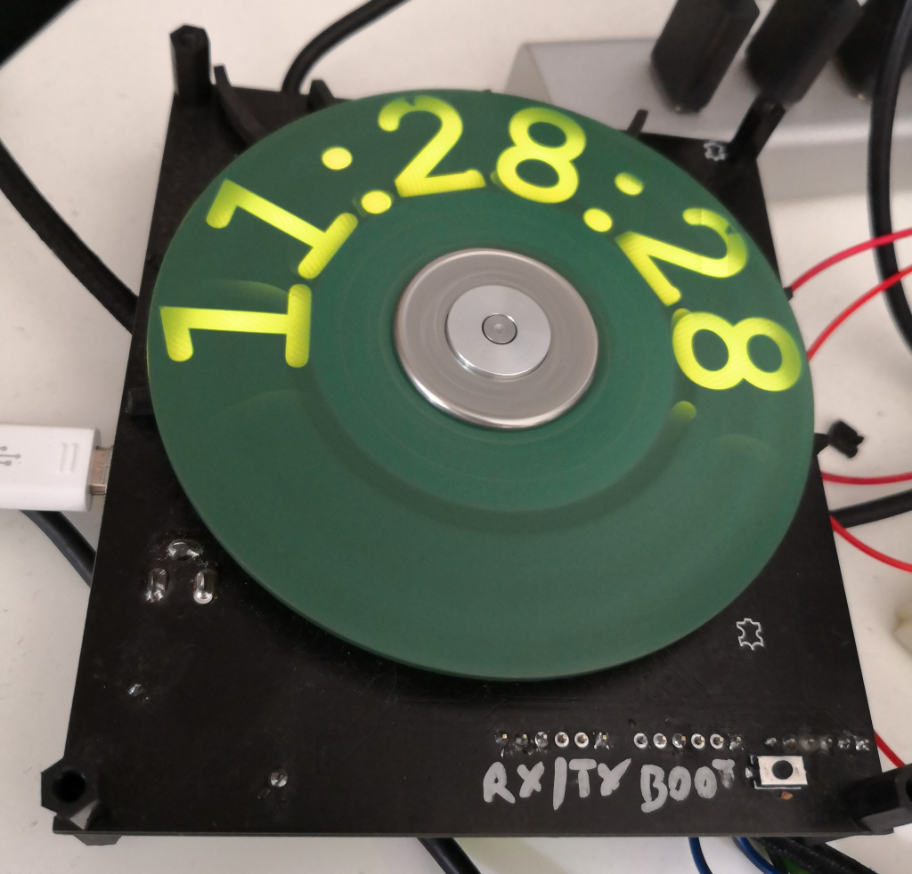

# HDDClockClone
This project is rewrite of the original HDDClock - https://github.com/pawsko/HDD_clock

## Changes & new features
- HAL instead of StdPeriph
- COM port on mini-USB connector - possibility to change date & time via console
- Migration to C++
- Huge code refactor

## Tools & Environment
- [STM32CubeIDE](https://www.st.com/en/development-tools/stm32cubeide.html)

## Media
#### HDD Clock

#### Serial console

